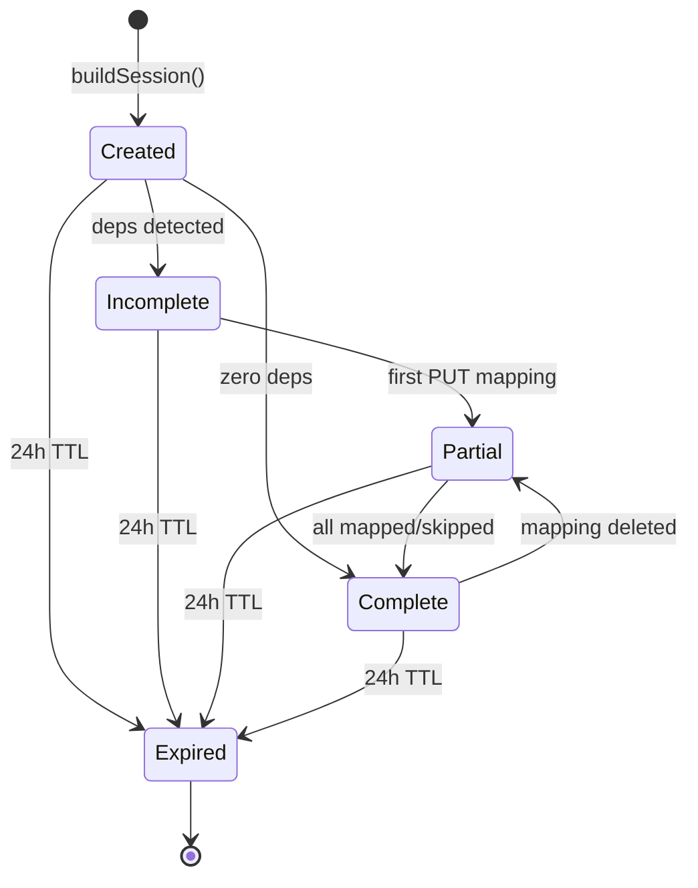

# @atlasreforge/field-registry

> Field Mapping Registry: session lifecycle, Server→Cloud ID mapping, and `ATLAS_*()` placeholder resolution.

---

## Public API

```typescript
import {
  RegistryService,
  InMemoryRegistryStore,
  PlaceholderResolver,
} from '@atlasreforge/field-registry';

const store = new InMemoryRegistryStore();
const registry = new RegistryService(store);

// Build session from parser deps
const session = await registry.buildSession(jobId, dependencyMap);

// Map a field
await registry.updateField(jobId, {
  serverFieldId: 'customfield_10048',
  cloudFieldId: 'customfield_10201',
});

// Check completion
const status = await registry.getSession(jobId);
status.isComplete           // true when all mapped/skipped
status.completionBlockers   // entities blocking deployment

// Resolve placeholders
const { patchedFiles } = await registry.resolveFiles(jobId, forgeFiles);
```

## Session Lifecycle



Key properties:
- Created immediately after parsing (before any LLM call)
- Bootstrapped from `DependencyMap` (customFields, groups, users)
- **24-hour TTL** — ephemeral by design, never persisted to DB
- `isComplete: true` when ALL mappings are `mapped` or `skipped`
- Transitions back from "complete" → "partial" if a mapping is deleted

## Mapping Types

### CustomFieldMapping

| Property | Type | Description |
|----------|------|-------------|
| serverFieldId | string | Server customfield ID (e.g., `customfield_10048`) |
| cloudFieldId | string \| null | Cloud customfield ID after mapping |
| status | `unmapped` \| `mapped` \| `skipped` | Current state |
| usageType | `read` \| `write` \| `search` | How the field is used in script |
| inferredPurpose | string | Business purpose inferred from context |

### GroupMapping

| Property | Type | Description |
|----------|------|-------------|
| serverGroupName | string | Server group name |
| cloudGroupId | string \| null | Cloud group UUID |
| status | `unmapped` \| `mapped` \| `skipped` | Current state |

### UserMapping (GDPR Critical)

| Property | Type | Description |
|----------|------|-------------|
| serverIdentifier | string | Username or userKey from Server |
| identifierType | `username` \| `userKey` | Type of Server identifier |
| cloudAccountId | string \| null | Cloud accountId (UUID) |
| status | `unmapped` \| `mapped` \| `skipped` | Current state |
| gdprRisk | `high` | Always high — usernames are personal data |
| resolutionStrategy | string \| null | How the mapping was resolved |

## Placeholder Resolution

`PlaceholderResolver` is a pure function operating on three pattern types:

```
ATLAS_FIELD_ID("customfield_10048")   → mapped Cloud field ID
ATLAS_GROUP_ID("jira-finance-team")   → mapped Cloud group UUID
ATLAS_ACCOUNT_ID("jsmith")           → resolved accountId
```

**Resolution rules:**
- **Mapped** → replaced with the Cloud value
- **Skipped** → replaced with inline comment: `// ATLAS_UNRESOLVED: x — SKIPPED`
- **Still unmapped** → left intact, reported in `unresolvedPlaceholders[]`

## Store Interface

```typescript
interface RegistryStore {
  saveSession(session: RegistrySession): Promise<void>;
  getSession(jobId: string): Promise<RegistrySession | null>;
  deleteSession(jobId: string): Promise<void>;
  destroy(): void;
}
```

| Implementation | Use Case |
|---------------|----------|
| `InMemoryRegistryStore` | Development + testing |
| Redis-backed (planned) | Production with persistence |

## Key Files

| File | Purpose |
|------|---------|
| `src/registry.service.ts` | Session CRUD, mapping updates, completion tracking |
| `src/placeholder.resolver.ts` | Pure function placeholder substitution |
| `src/stores/in-memory.store.ts` | Map-based store with TTL cleanup |
| `src/types/registry.types.ts` | Session, mapping, and resolver types |
