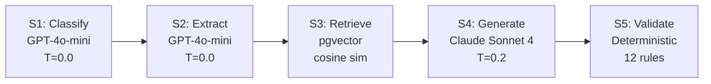
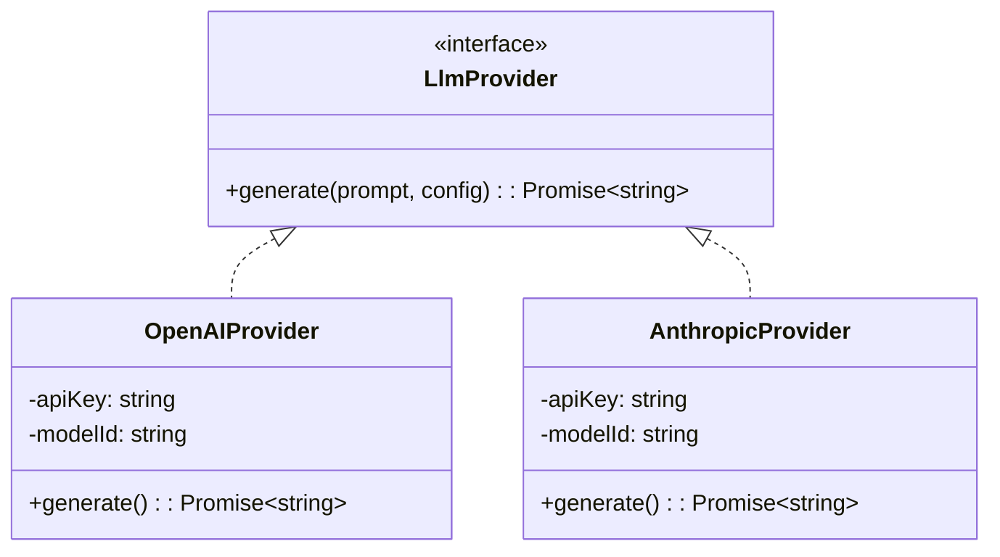

# @atlasreforge/llm-orchestrator

> Stages 1–5: Desynchronised LLM pipeline for script migration. Typed inputs/outputs per stage with independent retry, caching, and monitoring.

---

## Public API

```typescript
import {
  OrchestratorService,
  OpenAIProvider,
  AnthropicProvider,
  NoopRagRetriever,
  DEFAULT_ORCHESTRATOR_CONFIG,
} from '@atlasreforge/llm-orchestrator';

const orchestrator = new OrchestratorService({
  ...DEFAULT_ORCHESTRATOR_CONFIG,
  maxRetries: 2,
  ragEnabled: true,
});

const result = await orchestrator.run(
  { jobId, parsedScript, rawScriptContent },
  { classifierProvider, generatorProvider, ragRetriever },
);

result.forgeFiles       // Generated Forge code files
result.scriptRunnerCode // Generated SR Cloud Groovy
result.diagram          // Mermaid sequence diagram
result.confidence       // Per-area confidence scores
result.pipeline         // Telemetry: tokens, duration, cost
```

## Pipeline Stages



| Stage | Model | Temperature | Input | Output |
|-------|-------|-------------|-------|--------|
| S1 Classify | GPT-4o-mini | 0.0 | ParsedScriptShell | moduleType, complexity, migrationTarget, costEstimate |
| S2 Extract | GPT-4o-mini | 0.0 | ParsedScript + S1 | enrichedFields, businessLogic, detectedPatterns → RAG queries |
| S3 Retrieve | pgvector | — | S1+S2 outputs | Top-10 ranked doc chunks (≤8 parallel queries) |
| S4 Generate | Claude Sonnet 4 | 0.2 | All prior + raw script | forgeFiles, srCode, diagram, confidence, placeholders |
| S5 Validate | Deterministic | — | S4 output | issues[], autoFixCount, patched files |

## Meta-Prompt Security

- Script content wrapped in XML-delimited tags (`<script>`, `<legacy_code>`)
- Explicit instruction: content inside tags is **untrusted user code**
- Models output ONLY valid JSON — no prose, no markdown fences
- `</script>` sequences sanitised to `</ script>` before wrapping
- Size limits: S1 = 6K chars, S2 = 8K chars, S4 = 10K chars
- FORBIDDEN APIs enumerated in S4 system prompt, caught by S5

## S5 Auto-Validator Rules

| Rule | Category | Action |
|------|----------|--------|
| VAL_001–006 | Server Java APIs | Zero tolerance for ComponentAccessor, IssueManager, etc. |
| VAL_010–012 | GDPR | Zero tolerance for username/userKey |
| VAL_020 | REST API | Auto-upgrade `/rest/api/2/` → `/rest/api/3/` |
| VAL_030–032 | Forge safety | Check fetch egress, infinite loops, pagination |
| VAL_040 | Custom fields | Flag unresolved customfield IDs as warnings |

## Provider Abstraction



## Key Files

| File | Purpose |
|------|---------|
| `src/orchestrator.service.ts` | Pipeline orchestration — S1→S5 sequential execution |
| `src/stages/s1-classifier.ts` | Module type + complexity classification |
| `src/stages/s2-extractor.ts` | Semantic extraction + RAG query generation |
| `src/stages/s3-retriever.ts` | pgvector similarity search dispatcher |
| `src/stages/s4-generator.ts` | Code generation with RAG context injection |
| `src/stages/s5-validator.ts` | Deterministic rule evaluation + auto-fix |
| `src/providers/openai.provider.ts` | OpenAI API wrapper |
| `src/providers/anthropic.provider.ts` | Anthropic API wrapper |

## Error Handling

```typescript
class PipelineError extends Error {
  stage: string;    // Which stage failed
  retriable: boolean;
}
```

Each stage has independent retry logic. `maxRetries` configurable (default: 2 in production, 0 in dev).
