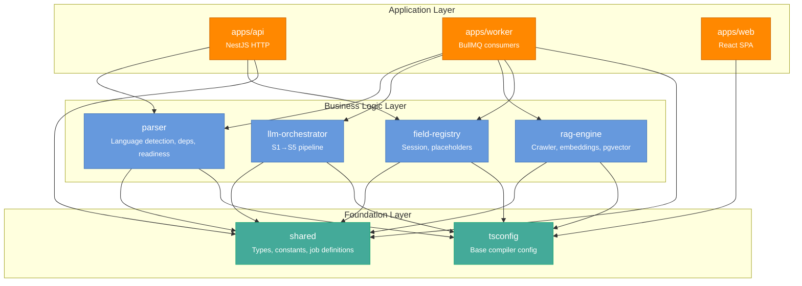

# Packages Overview

> Monorepo structure, dependency graph, build order, and package roles.

---

## Monorepo Layout

```
AtlasReforge/
├── packages/                   # Shared libraries
│   ├── shared/                 # Cross-package types and constants
│   ├── tsconfig/               # Base TypeScript configuration
│   ├── parser/                 # Stage 0: Code analysis engine
│   ├── rag-engine/             # Stage 3: RAG pipeline + DB
│   ├── llm-orchestrator/       # Stages 1–5: LLM pipeline
│   └── field-registry/         # Field/Group/User mapping
├── apps/                       # Deployable applications
│   ├── api/                    # NestJS HTTP server
│   ├── worker/                 # BullMQ background processor
│   └── web/                    # React SPA frontend
└── infra/                      # Docker + Kubernetes configs
```

---

## Dependency Graph



---

## Build Order

Dependencies must be built before consumers:

```bash
# 1. Foundation (no deps)
pnpm --filter @atlasreforge/shared build
pnpm --filter @atlasreforge/tsconfig build   # (no-op, config only)

# 2. Business logic (depends on shared)
pnpm --filter @atlasreforge/parser build
pnpm --filter @atlasreforge/rag-engine build
pnpm --filter @atlasreforge/llm-orchestrator build
pnpm --filter @atlasreforge/field-registry build

# 3. Applications (depend on packages)
pnpm --filter @atlasreforge/api build
pnpm --filter @atlasreforge/worker build
pnpm --filter @atlasreforge/web build

# Or use Turborepo for automatic dependency resolution:
pnpm build    # turbo handles the graph
```

---

## Package Summaries

| Package | Purpose | Key Exports | Tests | Docs |
|---------|---------|-------------|-------|------|
| [shared](shared) | Types + constants | `QUEUES`, `JOB_NAMES`, `MigrationJobData`, `RagCrawlJobData` | — | — |
| [parser](parser.md) | Code analysis | `ParserService`, `ParsedScript`, strategies | 90+ | [→](parser.md) |
| [rag-engine](rag-engine.md) | RAG pipeline | `RagService`, `PgvectorRetriever`, `createPool`, crawl scheduler | 31 | [→](rag-engine.md) |
| [llm-orchestrator](llm-orchestrator.md) | LLM pipeline | `OrchestratorService`, providers, pipeline types | 40+ | [→](llm-orchestrator.md) |
| [field-registry](field-registry.md) | ID mapping | `RegistryService`, `PlaceholderResolver`, stores | 28+ | [→](field-registry.md) |
| [worker](worker.md) | Job processing | `processMigration`, `processRagCrawl`, health server | — | [→](worker.md) |

---

## Tooling

| Tool | Version | Purpose |
|------|---------|---------|
| pnpm | 9.14.2 | Workspace package manager |
| Turborepo | 2.8+ | Build orchestration + caching |
| TypeScript | 5.7+ | Type system |
| Vitest | 2.1+ | Test framework |
| ESLint | 9+ | Linting |
| Prettier | 3.8+ | Formatting |
