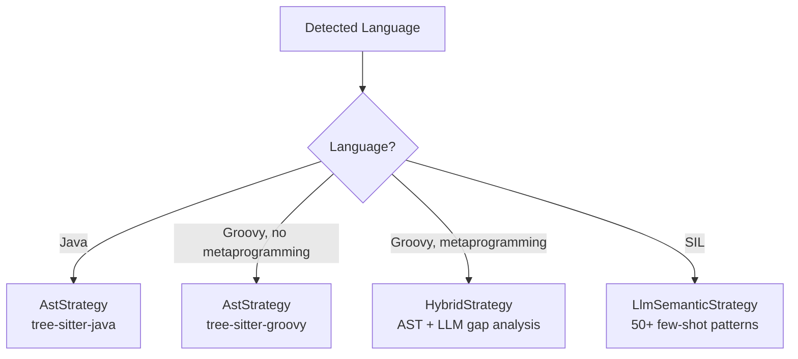

# @atlasreforge/parser

> Stage 0: Multi-strategy code analysis engine. Foundational package — its output (`ParsedScript`) is the typed contract consumed by all downstream stages.

---

## Public API

```typescript
import { ParserService } from '@atlasreforge/parser';

const parser = new ParserService({ enableAst: true });

const result = await parser.parse({
  content: groovyScript,
  filename: 'budget-approval.groovy',
  requestId: 'job-uuid',
});

result.language          // 'groovy' | 'java' | 'sil'
result.moduleType        // 'post-function' | 'validator' | 'listener' | ...
result.cloudReadiness    // { score: 45, overallLevel: 'yellow', ... }
result.dependencies      // { customFields, groups, users, httpCalls, ... }
result.complexity        // 'low' | 'medium' | 'high'
```

## Architecture

### Language Detection

Multi-signal scoring engine with four signal categories:

| Signal | Weight | Description |
|--------|--------|-------------|
| File extension | 40 | `.groovy` → Groovy, `.java` → Java, `.sil` → SIL |
| Syntax patterns | 30 | Language-specific constructs (diminishing returns) |
| Atlassian API patterns | 10 | ScriptRunner, ComponentAccessor, etc. |
| Negative signals | — | Exclude languages (e.g., `def x =` prevents Java) |

Confidence is qualified by the margin between top two candidates.

### Strategy Dispatch



### Dependency Extraction

Deterministic regex extraction (no LLM):

| Category | Pattern Examples | Output |
|----------|-----------------|--------|
| Custom fields | `customfield_XXXXX` | fieldId, usageType (read/write/search) |
| Groups | `groupManager.getGroup()`, `isUserInGroup()` | group references |
| Users (GDPR) | `getUserByName()`, `runAs()`, `userKey` | username references with gdprRisk |
| HTTP calls | `Unirest.get/post`, `httpClient`, URL constructors | external call targets |
| REST API | `/rest/api/2/`, `/rest/api/3/` | endpoint + version detection |
| Deprecated APIs | `ComponentAccessor`, `IssueManager`, `java.io.File` | blocker flags |

### Cloud Compatibility Analysis

Pure function implementing 20 rules (CR-001 through CR-020):

- **RED** (blockers): -25 points each (ComponentAccessor, filesystem, OFBiz SQL, etc.)
- **YELLOW** (paradigm shifts): -10 points each (REST v2, username usage, etc.)
- **GREEN** (confirmations): compatible patterns confirmed

Score: 0–100. ≥70 = 🟢, 40–69 = 🟡, <40 = 🔴.

## Key Files

| File | Purpose |
|------|---------|
| `src/parser.service.ts` | Main entry point — orchestrates detection → strategy → extraction → analysis |
| `src/detectors/language.detector.ts` | Multi-signal scoring engine |
| `src/detectors/module-type.detector.ts` | Detects ScriptRunner module type |
| `src/extractors/dependency.extractor.ts` | Deterministic regex extraction |
| `src/analyzers/cloud-compatibility.analyzer.ts` | 20-rule pure function analyzer |
| `src/strategies/ast.strategy.ts` | tree-sitter-based parsing |
| `src/strategies/llm-semantic.strategy.ts` | LLM few-shot parsing for SIL |
| `src/strategies/hybrid.strategy.ts` | AST + LLM gap analysis |

## Tests

90+ unit tests covering all detection, extraction, and analysis scenarios. Five real-world script fixtures:

1. Groovy ScriptRunner post-function (expected: YELLOW)
2. SIL validator (tests LLM semantic strategy)
3. Java plugin with filesystem + OFBiz SQL (expected: RED)
4. Groovy with metaprogramming (tests Hybrid dispatch)
5. Groovy REST API v3 only (expected: GREEN)
