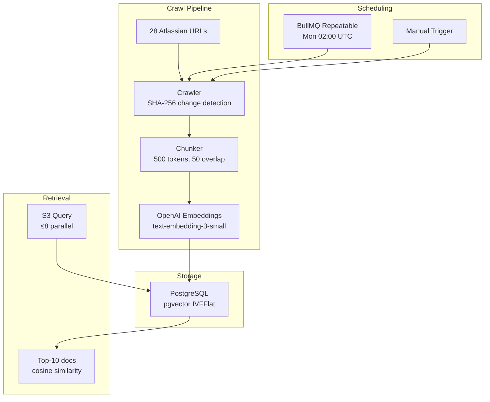

# @atlasreforge/rag-engine

> RAG pipeline: Atlassian documentation crawler, text chunker, OpenAI embeddings, pgvector retrieval, PostgreSQL pool management, and crawl scheduling.

---

## Public API

```typescript
import {
  RagService,
  createRagService,
  createPool,
  initializeSchema,
  checkPoolHealth,
  PgvectorRetriever,
  INIT_SQL,
  registerCrawlSchedule,
  triggerManualCrawl,
  CRAWL_TARGETS,
} from '@atlasreforge/rag-engine';
```

## Architecture



## Components

### DB Pool (`db/pool.factory.ts`)

PostgreSQL connection pool with production-grade resilience:

```typescript
const pool = await createPool({
  databaseUrl: process.env.DATABASE_URL,
  maxConnections: 10,
  idleTimeoutMs: 30_000,
  connectTimeoutMs: 10_000,
});
```

- **Retry logic:** Exponential backoff (1s → 10s max), 5 retries
- **pgvector verification:** Checks `pg_extension` on connect
- **Schema init:** `CREATE EXTENSION IF NOT EXISTS vector` + table creation
- **Health check:** `SELECT NOW()` for liveness probing

### Crawler (`crawler/atlassian-docs.crawler.ts`)

Crawls 28 Atlassian documentation URLs across 6 categories:

| Category | Examples |
|----------|---------|
| forge-api | Manifest, requestJira, fetch, storage, runtime |
| rest-api-v3 | Issues, fields, users, groups, workflows |
| oauth-scopes | Complete scope reference |
| scriptrunner-cloud | SR Cloud listeners, behaviours |
| migration-guide | Connect→Forge, Server→Cloud |
| forge-manifest | manifest.yml reference |

**Change detection:** SHA-256 hash comparison. Unchanged pages = 0 tokens = $0.

### Chunker (`crawler/chunker.ts`)

| Parameter | Value |
|-----------|-------|
| Target chunk size | 500 tokens |
| Overlap | 50 tokens |
| Code blocks | Never split — new chunk on code block |
| Token estimation | char/4 (avoids tiktoken WASM overhead) |

### Embeddings (`embeddings/openai-embeddings.ts`)

- Model: `text-embedding-3-small`
- Output: `vector(1536)` for pgvector storage
- Batch embedding for efficiency
- `toPgvectorString()` / `fromPgvectorString()` conversion utilities

### Retrieval (`retrieval/pgvector.retriever.ts`)

```sql
SELECT *, 1 - (embedding <=> $1::vector) AS similarity
FROM rag_documents
WHERE category = ANY($2)
ORDER BY embedding <=> $1::vector
LIMIT $3
```

- IVFFlat index (lists=100) for approximate nearest-neighbor
- Up to 8 parallel queries per job
- Results deduplicated by document ID, capped at 10

### Crawl Scheduler (`crawler/crawl.scheduler.ts`)

```typescript
await registerCrawlSchedule(ragCrawlQueue, {
  crawlCron: '0 2 * * 1',  // Monday 02:00 UTC
  enabled: true,
});

// Manual trigger
const jobId = await triggerManualCrawl(ragCrawlQueue, 'admin-request');
```

- BullMQ repeatable job with `key: 'atlassian-docs-weekly'`
- Configurable via `ATLASSIAN_DOCS_CRAWL_SCHEDULE` env var
- Failure recovery: job queued if worker down, processed on restart

### Seed Script (`seed/seed-rag.ts`)

One-time initial population:

```bash
pnpm --filter @atlasreforge/rag-engine seed
```

Requires `DATABASE_URL` and `OPENAI_API_KEY`. ~3 min, ~$0.01.

## Key Files

| File | Purpose |
|------|---------|
| `src/rag.service.ts` | Main service — crawl orchestration + embedding |
| `src/db/pool.factory.ts` | PostgreSQL pool with retry + pgvector check |
| `src/crawler/crawl-targets.ts` | 28 URL definitions with categories |
| `src/crawler/atlassian-docs.crawler.ts` | HTTP fetch + SHA-256 change detection |
| `src/crawler/chunker.ts` | Text chunking with code block preservation |
| `src/crawler/crawl.scheduler.ts` | BullMQ repeatable job registration |
| `src/embeddings/openai-embeddings.ts` | OpenAI embedding API wrapper |
| `src/retrieval/pgvector.retriever.ts` | Cosine similarity search |
| `src/seed/seed-rag.ts` | CLI seed script |
| `src/types/rag.types.ts` | Type definitions + DEFAULT_RAG_CONFIG |

## Tests

31 unit tests covering:
- HTML extraction (6 tests)
- Token estimation (3 tests)
- Chunker logic (5 tests)
- buildChunks metadata (4 tests)
- Additional crawl and retrieval tests (13 tests)

```bash
pnpm --filter @atlasreforge/rag-engine test
```
