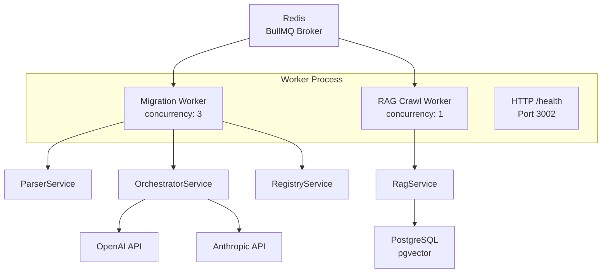

# apps/worker

> BullMQ background processor — migration pipeline + RAG crawl. Single Node.js process with multiple worker instances, graceful shutdown, and HTTP health endpoint.

---

## Overview

The worker bootstraps two BullMQ workers in a single process:

| Worker | Queue | Concurrency | Purpose |
|--------|-------|-------------|---------|
| migration-worker | `migration` | 3 (configurable) | Processes S1→S5 pipeline jobs |
| rag-crawl-worker | `rag-crawl` | 1 | Runs weekly Atlassian docs crawl |

## Architecture



## Migration Job Processing

The `processMigration()` function executes the full pipeline:

1. **Phase 1 — Parse** (synchronous, fast): `ParserService.parse()` extracts language, dependencies, cloud readiness
2. **Phase 2 — LLM Pipeline** (S1→S5): Sequential stage execution with progress updates
3. **Phase 3 — Registry Resolution**: If `session.isComplete`, resolves `ATLAS_*()` placeholders
4. **Phase 4 — Result Wrapping**: Enriches orchestrator output with parser-derived metadata (`originalFilename`, `cloudReadinessLevel`, `complexity`, `linesOfCode`, `estimatedEffortHours`, `workflowContext`) so the frontend receives a complete result shape

### Progress Reporting

Each phase updates `job.updateProgress()` for frontend polling:

| Stage | Progress |
|-------|----------|
| parsing | 10% |
| classifying | 25% |
| extracting | 40% |
| retrieving | 55% |
| generating | 75% |
| validating | 90% |
| resolving | 95% |
| completed | 100% |

### Mock Mode

Without API keys (`OPENAI_API_KEY`, `ANTHROPIC_API_KEY`), the worker returns mock results with:
- Placeholder `manifest.yml`
- Zero confidence scores with "API keys required" notes
- Full parser output (readiness, dependencies, complexity)

## Health Endpoint

HTTP server on port 3002 for container probes:

```json
GET /health → 200
{
  "status": "ok",
  "queues": {
    "migration": "active",
    "ragCrawl": "active"
  },
  "concurrency": 3,
  "uptime": 3600
}
```

Returns `503` when draining (shutdown in progress).

## Graceful Shutdown

On `SIGTERM` or `SIGINT`:

1. **Pause workers** — stop accepting new jobs (locally)
2. **Wait for in-flight jobs** — max 30s drain timeout
3. **Close workers** — BullMQ cleanup
4. **Close health server** — stop HTTP
5. **Destroy registry store** — cleanup timers
6. **Exit** — `process.exit(0)` on success, `1` on timeout

## Configuration

| Variable | Default | Description |
|----------|---------|-------------|
| `REDIS_URL` | `redis://localhost:6379` | Redis connection |
| `WORKER_CONCURRENCY` | 3 | Parallel migration jobs |
| `HEALTH_PORT` | 3002 | Health endpoint port |
| `NODE_ENV` | `development` | Affects retry count (prod: 2, dev: 0) |
| `OPENAI_API_KEY` | — | Required for real pipeline |
| `ANTHROPIC_API_KEY` | — | Required for real pipeline |

## Ephemeral Guarantee

- `scriptContent` from job data used in-memory only, never written to disk/DB
- `accessToken` used only for registry validation calls, never logged
- Each job runs in isolated async context — no shared mutable state

## Key Files

| File | Purpose |
|------|---------|
| `src/main.ts` | Entry point — worker bootstrap, health server, shutdown |
| `Dockerfile` | Multi-stage build (dev + production) |

## Docker

```dockerfile
# Development
FROM node:20-alpine AS development
CMD ["pnpm", "--filter", "@atlasreforge/worker", "dev"]

# Production (inherits from development builder)
```
