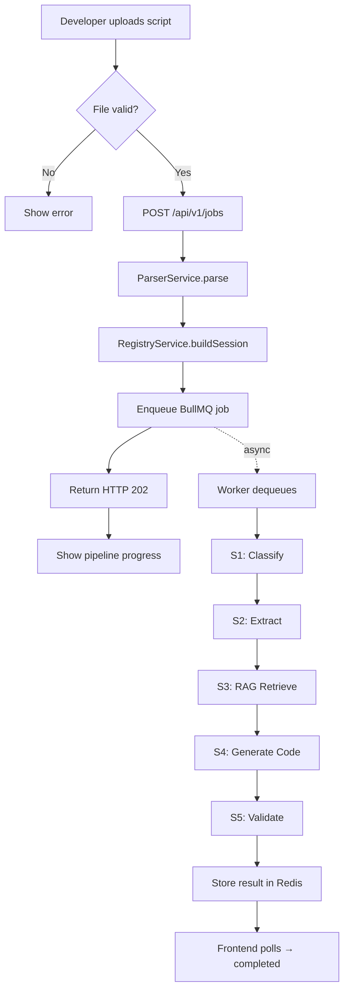
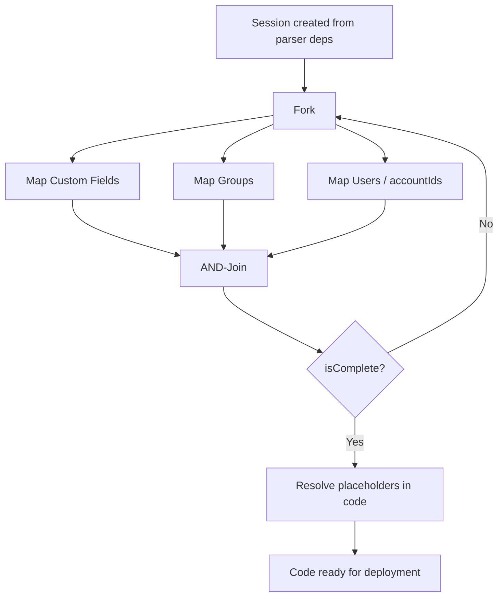
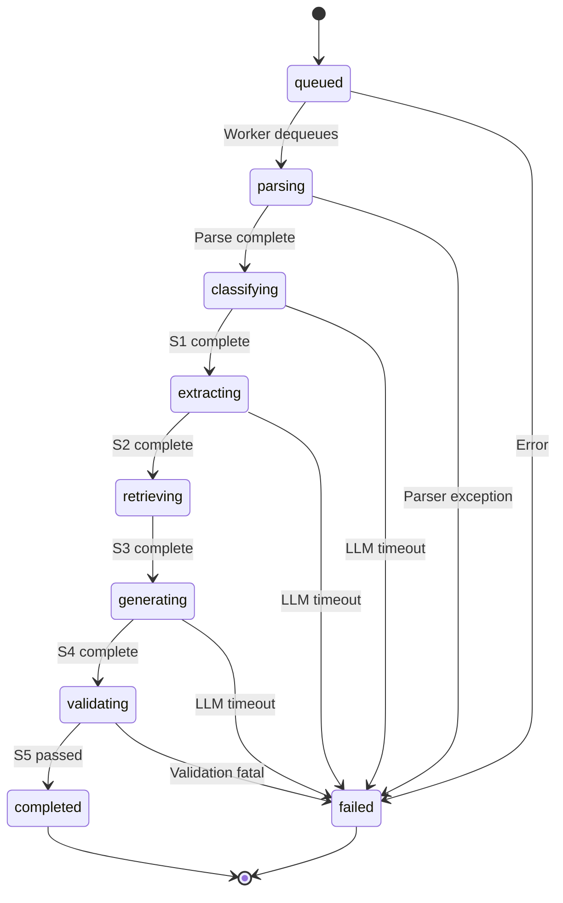
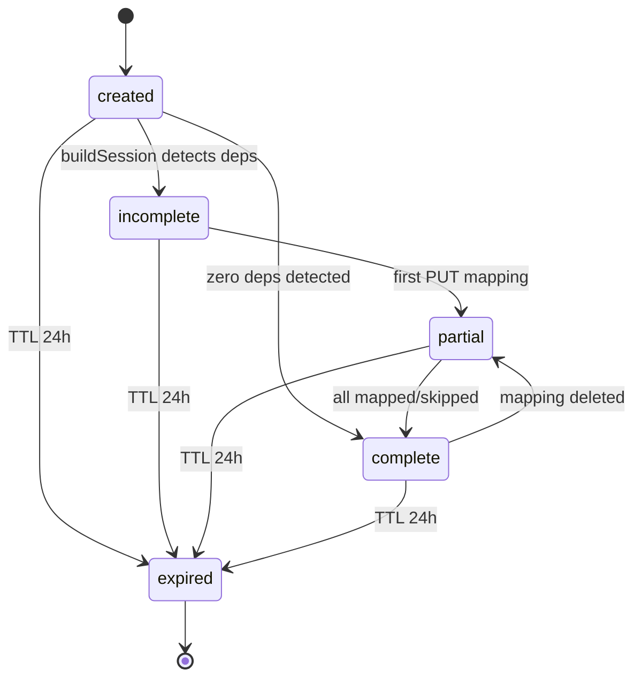
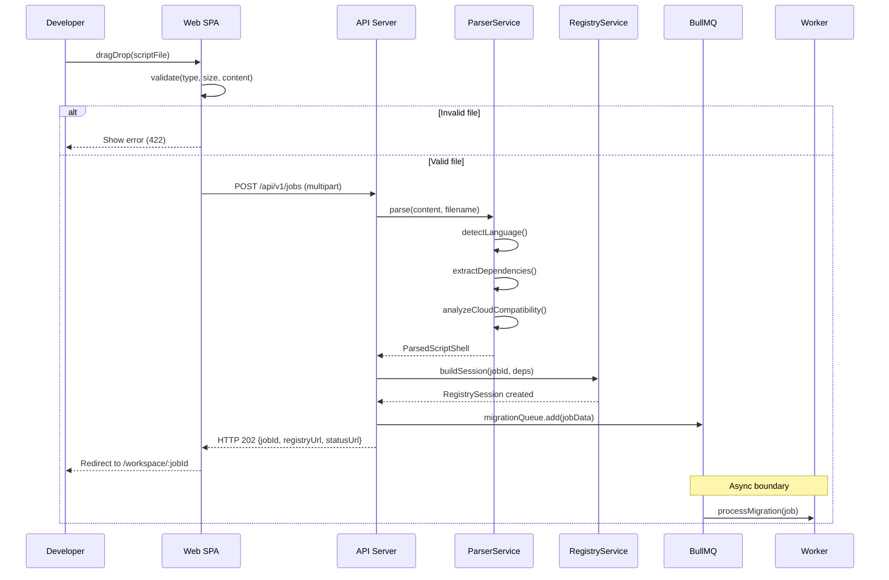

# Functional Analysis Document

> **Standard:** IEEE 830 SRS · UML 2.5 (OMG)  
> **Version:** 1.1 — Updated March 2026  
> **Status:** Approved — Baseline  
> **Diagrams:** FA-01 to FA-06 (.drawio) — open at [app.diagrams.net](https://app.diagrams.net)

---

## 1. Scope and Objectives

### 1.1 System Purpose

AtlasReforge AI automates the migration of Atlassian Server and Data Center automation scripts (Groovy, Java, SIL) to Atlassian Cloud equivalents — either Atlassian Forge or ScriptRunner Cloud. The system eliminates 80% of manual migration effort by automating code analysis, code generation, and environment-specific field mapping resolution.

### 1.2 System Boundary

**IN SCOPE:** Script upload, readiness analysis, LLM code generation, Field Mapping Registry, placeholder resolution, RAG index maintenance, Monaco split editor, Mermaid diagram rendering.

**OUT OF SCOPE:** Forge CLI deployment, Jira project configuration, ScriptRunner license procurement, user authentication (MVP: single-tenant dev mode).

### 1.3 Actors

| Actor | Type | Responsibilities |
|-------|------|------------------|
| Atlassian Developer | Primary human | Uploads scripts, reviews readiness report, completes registry, downloads generated code, edits code in split editor |
| Atlassian Administrator | Secondary human | Views triage dashboard, validates environment IDs, exports/imports registry sessions, manages multi-script migrations |
| System Scheduler | Automated | Triggers weekly BullMQ repeatable job to crawl and re-index Atlassian documentation (Monday 02:00 UTC) |
| Jira Cloud | External system | REST API v3: validates mapped custom field IDs, group IDs, and accountIds during UC-08 |
| OpenAI API | External system | Provides GPT-4o-mini (S1+S2 classification/extraction) and text-embedding-3-small (RAG vector embeddings) |
| Anthropic API | External system | Provides Claude Sonnet 4 for S4 code generation grounded in RAG context |

---

## 2. Use Case Model

> **Diagram:** [FA-01-use-case.drawio](../diagrams/FA-01-use-case.drawio) — 17 UCs, 4 actors, «include» and «extend» relationships.

### 2.1 Use Case Summary

| ID | Name | Primary Actor | Domain | Priority |
|----|------|---------------|--------|----------|
| UC-01 | Submit Script for Migration | Developer | Ingestion | MUST |
| UC-02 | View Cloud Readiness Report | Developer / Admin | Ingestion | MUST |
| UC-03 | Browse Triage Dashboard | Administrator | Ingestion | SHOULD |
| UC-04 | Map Custom Field to Cloud ID | Developer | Registry | MUST |
| UC-05 | Map Group to Cloud Group | Developer | Registry | MUST |
| UC-06 | Resolve User → accountId (GDPR) | Developer | Registry | MUST |
| UC-07 | Skip Mapping | Developer | Registry | SHOULD |
| UC-08 | Validate Mappings vs Jira Cloud | Developer / Admin | Registry | SHOULD |
| UC-09 | Export / Import Registry Session | Developer / Admin | Registry | COULD |
| UC-10 | View Generated Forge Code | Developer | Code Gen | MUST |
| UC-11 | View Generated SR Cloud Code | Developer | Code Gen | MUST |
| UC-12 | View Migration Sequence Diagram | Developer | Code Gen | SHOULD |
| UC-13 | Resolve Placeholders in Code | Developer | Code Gen | MUST |
| UC-14 | Download Generated Code | Developer | Code Gen | SHOULD |
| UC-15 | Weekly Atlassian Docs Crawl | System Scheduler | RAG | MUST |
| UC-16 | Embed New Documentation Chunks | System Scheduler | RAG | MUST |
| UC-17 | Trigger Manual RAG Seed | Administrator | RAG | SHOULD |

> For detailed use case specifications, see [Use Case Specifications](use-cases.md).

---

## 3. Activity Diagrams (UML 2.5)

> **Diagrams:**
> - [FA-02-activity-migration.drawio](../diagrams/FA-02-activity-migration.drawio) — full workflow, 6 swim lanes
> - [FA-03-activity-registry.drawio](../diagrams/FA-03-activity-registry.drawio) — registry workflow with parallel branches

### 3.1 Script Migration Workflow — Swim Lanes

The migration workflow spans six swim lanes: **Developer · Web SPA · API Server · Worker · LLM APIs · PostgreSQL + RAG**.

Key patterns:
- **Fork-join concurrency:** The Registry mapping workflow uses parallel branches (customFields, groups, users) with an AND-join before the `isComplete` check.
- **Loop:** The `isComplete` decision loops back to the mapping fork while unmapped items remain.
- **Asynchronous boundary:** An explicit separator marks where synchronous HTTP handling ends and BullMQ async processing begins.
- **Conditional flow:** File validation decision has two branches — invalid (error, stop) and valid (continue).

### 3.2 Field Mapping Registry Workflow

Registry workflow uses UML fork/join bars to represent three parallel mapping streams. The loop-back edge from the `isComplete` decision to the fork represents the iterative nature of partial mapping.

### 3.3 RAG Crawl Workflow

The weekly crawl uses an expanded loop (FOR each of 28 URLs) and an embedded loop (EMBED pending chunks in batches of 20). Change detection (SHA-256 hash comparison) is shown as a decision within the per-URL loop.

---

## 4. State Machine Diagrams (UML 2.5)

> **Diagram:** [FA-04-state-machines.drawio](../diagrams/FA-04-state-machines.drawio) — two state machines on one canvas.

### 4.1 Migration Job State Machine

8 transient states and 2 terminal states:

| State | Progress | Entry Condition |
|-------|----------|-----------------|
| queued | 0% | POST /jobs accepted — job in Redis |
| parsing | 10% | Worker dequeues job |
| classifying | 25% | ParserService.parse() returned |
| extracting | 40% | S1 GPT-4o-mini call complete |
| retrieving | 55% | S2 GPT-4o-mini call complete |
| generating | 75% | S3 pgvector retrieval complete |
| validating | 90% | S4 Claude call complete |
| completed | 100% | S5 auto-validator passed |
| failed | — | Any unrecoverable error |

### 4.2 Registry Session State Machine

Key constraint: session transitions back from "complete" to "partial" if a user deletes a mapping — ensuring `completionBlockers` is always accurate.

---

## 5. Sequence Diagrams (UML 2.5)

> **Diagram:** [FA-05-sequence-uc01.drawio](../diagrams/FA-05-sequence-uc01.drawio) — UC-01 full sequence, 7 lifelines.

### 5.1 UC-01 Sequence — Submit Script

Notable UML elements:
- **alt fragment:** File validation — one branch for invalid, one for valid
- **Self-calls:** `detectLanguage()`, `extractDependencies()`, `analyzeCloudCompatibility()` on `:ParserService`
- **Async separator:** Annotation bar separating synchronous HTTP from BullMQ async processing
- **Invariant:** Script content never reaches PostgreSQL

---

## 6. Functional Requirements (IEEE 830)

> **Diagram:** [FA-06-dfd-rtm.drawio](../diagrams/FA-06-dfd-rtm.drawio) — DFD Level 1 + Requirements Traceability Matrix.

| FR-ID | Requirement | Maps to | Priority |
|-------|-------------|---------|----------|
| FR-01 | System SHALL accept .groovy, .java, .sil, .SIL, .txt files ≤512 KB via drag-drop or REST multipart | UC-01 | MUST |
| FR-02 | System SHALL detect script language using multi-signal scoring (extension 40%, syntax 30%, API 10%) with ≥85% confidence | UC-01 | MUST |
| FR-03 | System SHALL extract all `customfield_XXXXX` references with usage type (read/write/search) | UC-01, UC-04 | MUST |
| FR-04 | System SHALL flag all username and userKey references as GDPR-risk "high" | UC-06 | MUST |
| FR-05 | System SHALL compute a Cloud Readiness Score (0–100) and level (🟢🟡🔴) using deterministic rule evaluation — no LLM | UC-02 | MUST |
| FR-06 | System SHALL report migration effort estimate: consultant hours vs AI-assisted hours with % savings | UC-02 | MUST |
| FR-07 | System SHALL generate Forge `manifest.yml` (with minimal OAuth scopes) + TypeScript resolvers | UC-10 | MUST |
| FR-08 | System SHALL generate ScriptRunner Cloud Groovy code with REST API v3 calls | UC-11 | MUST |
| FR-09 | System SHALL generate a Mermaid sequence diagram for the Cloud event flow | UC-12 | SHOULD |
| FR-10 | System SHALL compute and include minimal required OAuth scopes in `manifest.yml` | UC-10 | MUST |
| FR-11 | System SHALL inject `ATLAS_FIELD_ID()`, `ATLAS_GROUP_ID()`, `ATLAS_ACCOUNT_ID()` placeholders in generated code | UC-04,05,06,13 | MUST |
| FR-12 | System SHALL resolve all typed placeholders when `session.isComplete = true` | UC-13 | MUST |
| FR-13 | System SHALL auto-fix common deprecated patterns (REST v2→v3, `.getUsername()`→`.accountId`) | UC-10,11 | SHOULD |
| FR-14 | System SHALL allow user to validate mapped IDs against Jira Cloud REST API v3 | UC-08 | SHOULD |
| FR-15 | System SHALL allow export of RegistrySession as JSON and import into future jobs | UC-09 | COULD |
| FR-16 | System SHALL crawl 28 Atlassian documentation pages weekly (Mon 02:00 UTC) re-embedding only changed pages | UC-15,16 | MUST |
| FR-17 | System SHALL NEVER persist script content to PostgreSQL, disk, or any durable storage | UC-01 | MUST |
| FR-18 | System SHALL display live pipeline progress (0–100%) during processing | UC-01,02 | SHOULD |

---

## 7. Non-Functional Requirements

| NFR-ID | Category | Requirement | Acceptance Criterion |
|--------|----------|-------------|---------------------|
| NFR-01 | Performance | Script parse + registry bootstrap ≤ 3s | p95 on 512 KB Groovy file |
| NFR-02 | Performance | Full pipeline S1→S5 ≤ 20s | p95 excl. Jira validation |
| NFR-03 | Performance | S3 pgvector cosine search ≤ 200ms | 8 parallel queries, 10k chunk index |
| NFR-04 | Scalability | 3 concurrent migration jobs | BullMQ concurrency=3, no shared state |
| NFR-05 | Security | Script content never in PostgreSQL or disk | Log audit: scriptContent absent from SQL |
| NFR-06 | Security | Prompt injection attempts have no effect | 10 injection patterns tested |
| NFR-07 | Privacy (GDPR) | Zero username/userKey in generated code | VAL_010–012 enforced by S5 |
| NFR-08 | Reliability | Jobs survive worker SIGTERM (graceful drain) | Redis AOF + BullMQ drain on SIGTERM |
| NFR-09 | Reliability | RAG crawl failure on ≤3 URLs does not abort run | Per-URL error handling |
| NFR-10 | Usability | Registry Panel renders ≤50 items without pagination | 20 fields + 15 groups + 15 users |
| NFR-11 | Cost | Pipeline cost per job ≤ $0.10 USD | PipelineTelemetry.totalCostUsd |
| NFR-12 | Availability | All containers restart on failure | `restart: unless-stopped` |

---

## 8. Business Rules

| BR-ID | Rule | Rationale |
|-------|------|-----------|
| BR-01 | Script content MUST NOT be written to any durable storage. Redis TTL: 24h. | Legal: script may contain customer IP |
| BR-02 | Generated Cloud code MUST NOT contain username or userKey. Only accountId. | GDPR: usernames are personal data in Cloud |
| BR-03 | Generated code MUST only call `/rest/api/3/`. v2 is forbidden. | REST API v2 is deprecated in Cloud |
| BR-04 | Generated Forge code MUST NOT reference `ComponentAccessor`, `IssueManager`, or any Server Java API. | These APIs don't exist in Cloud runtime |
| BR-05 | OAuth scopes in `manifest.yml` MUST be the minimal set required. | Forge app review rejects over-requested scopes |
| BR-06 | A RegistrySession expires exactly 24 hours after creation. | Ephemeral design: user must re-submit if session lapses |
| BR-07 | Generated code MUST use `ATLAS_FIELD_ID()` placeholders until the Registry is complete. | Cloud field IDs are environment-specific |
| BR-08 | Cloud Readiness Score MUST be computed deterministically without any LLM call. | Score must be auditable and reproducible |
| BR-09 | RAG crawl MUST use SHA-256 content hashing for change detection. | Cost control: re-embedding only changed pages ≈ $0.004/week |
| BR-10 | S5 auto-validator MUST run on ALL generated code before client return. | Quality gate: prevents deprecated API patterns |

---

## 9. MoSCoW Prioritisation

| Priority | Requirements / Use Cases |
|----------|--------------------------|
| **MUST HAVE** | FR-01–08, FR-10–12, FR-16–17; UC-01,02,04,05,06,10,11,13,15,16 |
| **SHOULD HAVE** | FR-09,13,14,18; UC-03,07,08,09,12,14,17 |
| **COULD HAVE** | FR-15; UC-09 |
| **WON'T HAVE (v1.0)** | Automated forge deploy, multi-tenant billing, Confluence migration |

---

## 10. Glossary

| Term | Definition |
|------|------------|
| accountId | Atlassian Cloud user identifier — opaque UUID replacing GDPR-illegal username |
| ATLAS_FIELD_ID() | Placeholder in generated code for a Server customfield ID pending Cloud mapping |
| BullMQ | Redis-backed Node.js job queue with priorities, repeatable jobs, concurrency |
| Cloud Readiness Score | 0–100 deterministic score. ≥70 = 🟢, 40–69 = 🟡, <40 = 🔴 |
| DFD | Data Flow Diagram showing data movement between processes and stores |
| Forge | Atlassian serverless platform for Cloud apps, replaces Connect |
| GDPR | EU regulation. In Cloud: username is personal data; accountId is the safe replacement |
| OFBiz | Apache OFBiz — entity engine under Jira Server/DC, impossible in Cloud |
| pgvector | PostgreSQL extension adding vector(1536) type + IVFFlat cosine similarity index |
| RAG | Retrieval-Augmented Generation — injects doc chunks as LLM context |
| RegistrySession | In-memory session (24h TTL) mapping Server IDs to Cloud IDs per job |
| SIL | Simple Issue Language — proprietary Adaptavist scripting, no public grammar |
| ScriptRunner Cloud | Groovy scripting for Cloud via REST API calls (no in-memory Java) |
| UC | Use Case — sequence of actions yielding observable value to an actor (OMG UML 2.5) |
