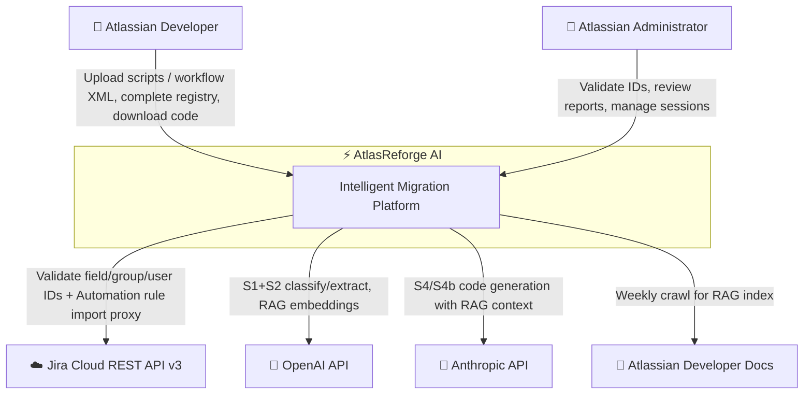
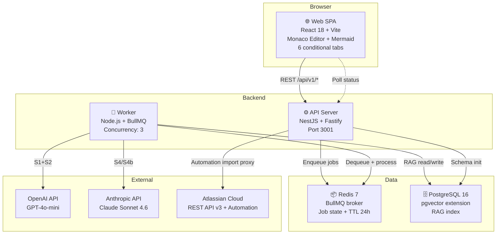
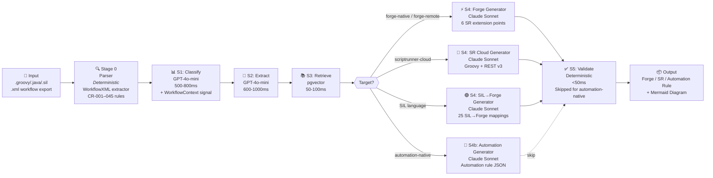
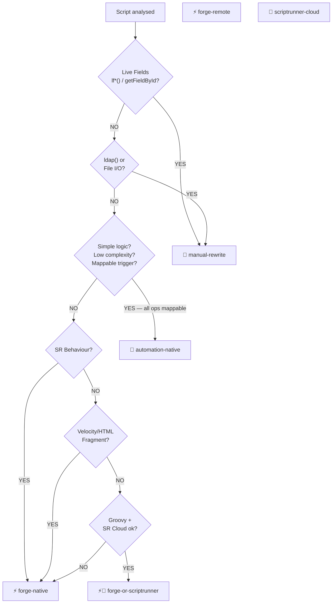
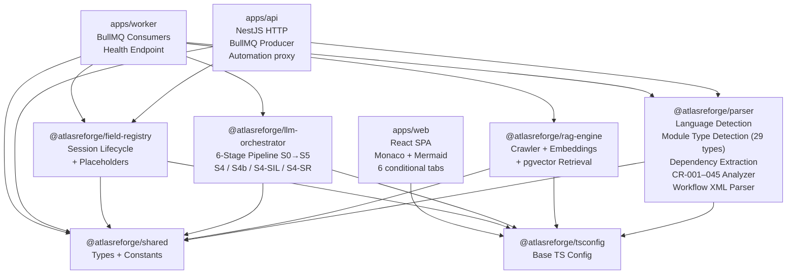
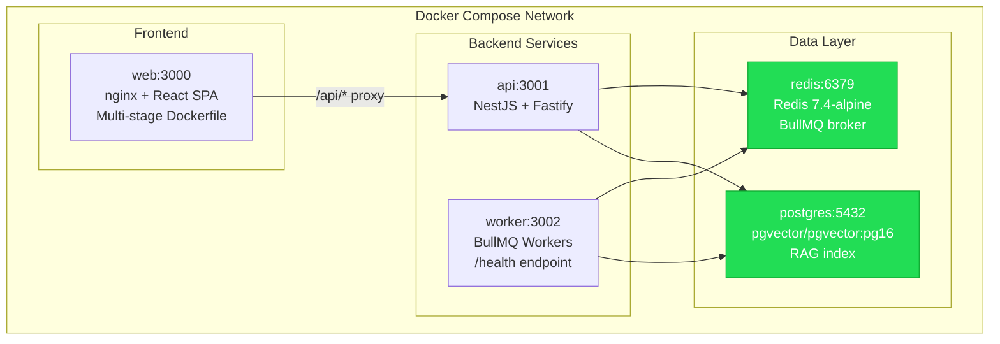
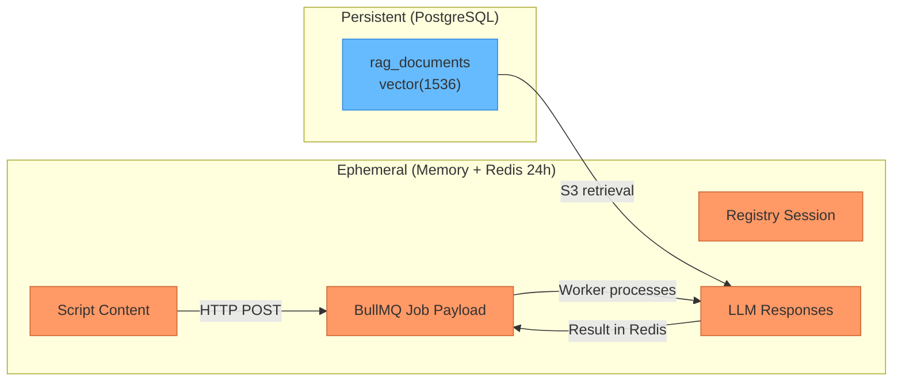

# Architecture Overview

> Mermaid diagrams for GitHub rendering.

---

## C4 — System Context

---

## C4 — Container View

---

## 6-Stage LLM Pipeline (with S4 fork)

---

## Migration Targets

---

## Monorepo Package Graph

---

## Deployment Topology (Docker Compose)

**Startup Order:** `postgres` → `redis` → `api` → `worker` → `web` (all use `service_healthy` conditions)

---

## Data Flow

> ⚠️ **Orange = ephemeral** (never persisted). **Blue = persistent** (only RAG docs, never customer code).
